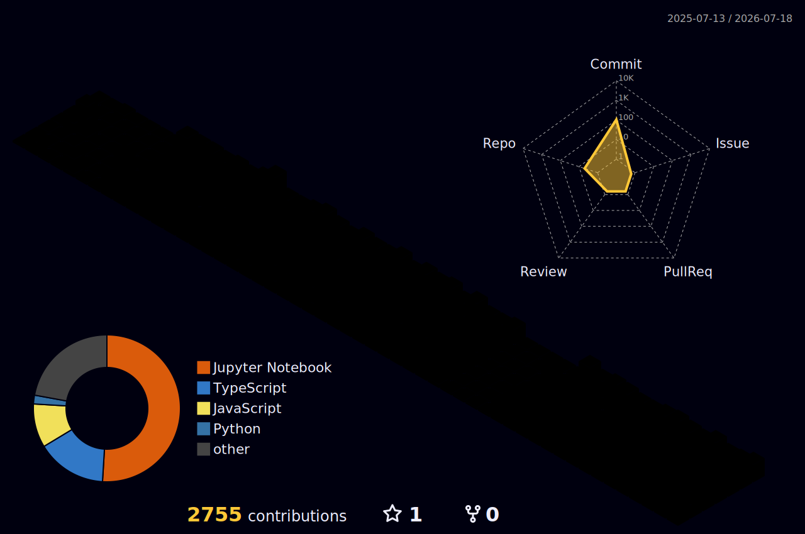

<p align="center">
  <a href="https://git.io/typing-svg">
    
  </a>
</p>

<br/>

<p align="center">
  🎓 🎓 M.Sc. Data Science Student @ <a href="https://www.nmims.edu/">SVKM's NMIMS</a>, Mumbai
</p>

<p align="center">
📍 Mumbai, India
</p>

<p align="center">
  <a href="mailto:jaiswalharshit444@gmail.com" title="Mail • jaiswalharshit444@gmail.com">
    
  </a>
  &nbsp;&nbsp;&nbsp;

  <a href="https://www.linkedin.com/in/harshit-jaiswal-hj18032005/" title="LinkedIn • Harshit Jaiswal">
    
  </a>
  &nbsp;&nbsp;&nbsp;

  <a href="https://github.com/harshitt018" title="Github • harshitt018">
    
  </a>
  &nbsp;&nbsp;&nbsp;

  <a href="https://www.instagram.com/harshitttt.018/" title="Instagram • @harshitttt.018">
    
  </a>
</p>

<br/>

<h2>🚀 About Me</h2>

```yaml
About:
• M.Sc. Data Science Student at SVKM's NMIMS, Mumbai

• B.Sc. Information Technology Graduate

• Published Researcher (IJAIR 2026)

• Passionate about Artificial Intelligence, Machine Learning, Deep Learning, Generative AI and NLP

• Building end-to-end AI applications using Python

• Interested in Computer Vision, LLMs, Time Series Forecasting and Intelligent Systems

• Open Source Contributor & Continuous Learner

• Aspiring AI Engineer and Data Scientist

```
<br/>

## 🎓 Education

| Degree | Institution | Duration | Location |
|--------|-------------|----------|----------|
| **Master of Science (M.Sc.) in Data Science** | **SVKM's Narsee Monjee Institute of Management Studies (NMIMS)** | **Currently Pursuing — Batch 2026** | Mumbai, India |
| **Bachelor of Science (B.Sc.) in Information Technology** | **Sheth L. U. J. College of Arts & Sir M. V. College of Science and Commerce** | **2023 – 2026** | Mumbai, India |

<br/>

## 📚 Currently Learning

- Supervised Machine Learning
- Mathematics for Data Science
- Database Management Systems
- Storytelling with Data
- Research Methodology

<br/>

<h2>🌟 Featured Projects</h2>

<table>
<tr>

<td width="50%" valign="top">

<h3>🧠 Gen-Z Language Translator</h3>

<p>
A Transformer-based NLP system for bidirectional translation between
Gen-Z slang and Standard English. Built using T5 architecture with
lexical augmentation, explainable AI techniques, and evaluation using BLEU scores.
</p>

<p>
<b>Tech:</b> Python • TensorFlow • NLP • Transformers • Deep Learning
</p>

<a href="https://github.com/harshitt018/T5-Based-Transformer-Model-for-Interpretable-Bidirectional-Translation-of-Informal-Gen-Z-Language">
🔗 View Repository
</a>

</td>

<td width="50%" valign="top">

<h3>📊 Advance Data Science</h3>

<p>
A comprehensive collection of Machine Learning, Deep Learning, NLP,
Computer Vision, Time Series Forecasting, GANs, Autoencoders,
Transformers, YOLO, and Generative AI implementations.
</p>

<p>
<b>Tech:</b> Python • TensorFlow • PyTorch • Scikit-Learn • OpenCV
</p>

<a href="https://github.com/harshitt018/Advance-Data-Science">
🔗 View Repository
</a>

</td>

</tr>
</table>

<br/>

## 📄 Research & Publications

This repository accompanies the published research paper:

**A T5-Based Transformer Model for Interpretable Bidirectional Translation of Informal Gen-Z Language**

*International Journal of Advance and Innovative Research (IJAIR), Volume 13, Issue 1 (XIII), January–March 2026*

**Authors:** Harshit Jaiswal, Sumitkumar Tripathi, Dr. Mahendra K. Kanojia

📖 **Published Paper:** https://iaraedu.com/about-journal/ijair-volume-13-issue-1-xiii-january-march-2026.php

🔗 **DOI:** https://zenodo.org/records/20354105

🎤 **Presented At:** ICMVLU 2026 Conference (28 February 2026)

<div align="center">

## 📬 Let's Connect

  <p align="center">
  
  <a href="https://www.linkedin.com/in/harshit-jaiswal-hj18032005/">
  
  </a>
  
  <a href="mailto:jaiswalharshit444@gmail.com">
  
  </a>
  
  </p>

  <p align="center">
    <sub>
      Thank you for reading this research. Academic discussions, collaborations, and feedback are always welcome.
    </sub>
  </p>
</div>

</br>

## 🛠️ Tech Stack

### Languages


### Data Science & Machine Learning


### Data Visualization


### Web & App Development


### Databases & APIs


### Tools, Cloud & Deployment


<br/>

## 📊 GitHub Analytics

<p align="center">
  
</p>

<p align="center">
  

  
</p>

<p align="center">
  
</p>

<p align="center">
  
</p>

<br/>

### ✍️ **Random Dev Quote**:
<div align="center">
    
</div>

<br/>

## 🐍 GitHub Contribution Snake

<p align="center">
  
</p>

<p align="center">
  <b>⚡ My contribution journey, one commit at a time.</b>
</p>

<picture>
  <source media="(prefers-color-scheme: dark)" srcset="https://raw.githubusercontent.com/harshitt018/harshitt018/output/github-snake-dark.svg" />
  <source media="(prefers-color-scheme: light)" srcset="https://raw.githubusercontent.com/harshitt018/harshitt018/output/github-snake.svg" />
  
</picture>

<p align="center">
  <sub>
    Research • Build • Deploy • Learn • Repeat
  </sub>
</p>
<p align="center">
  <sub>
    Turning research into intelligent AI solutions.
  </sub>
</p>

<p align="center">
  
</p>
